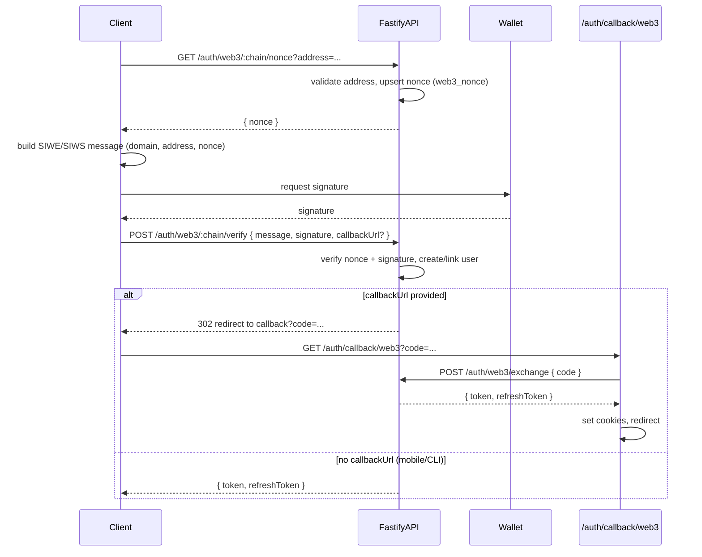
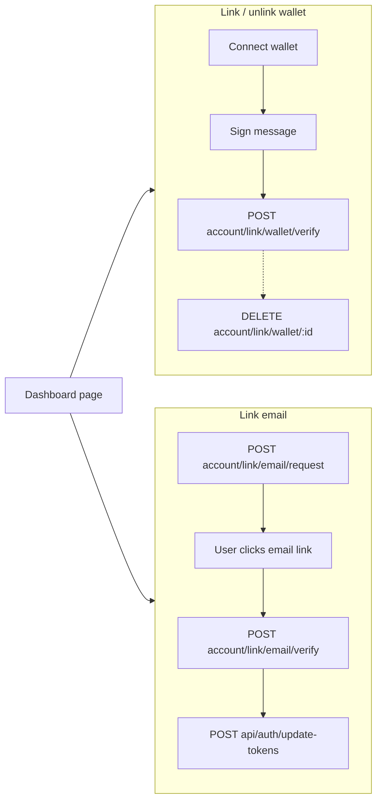
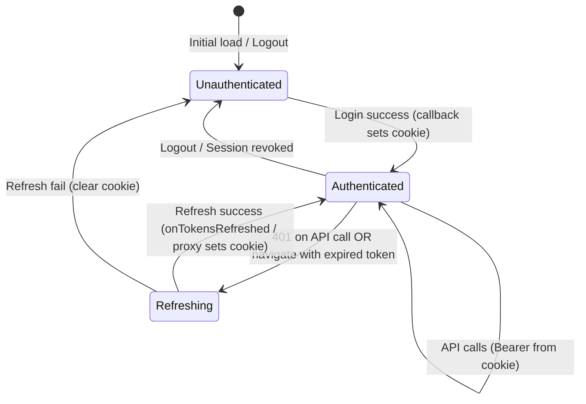
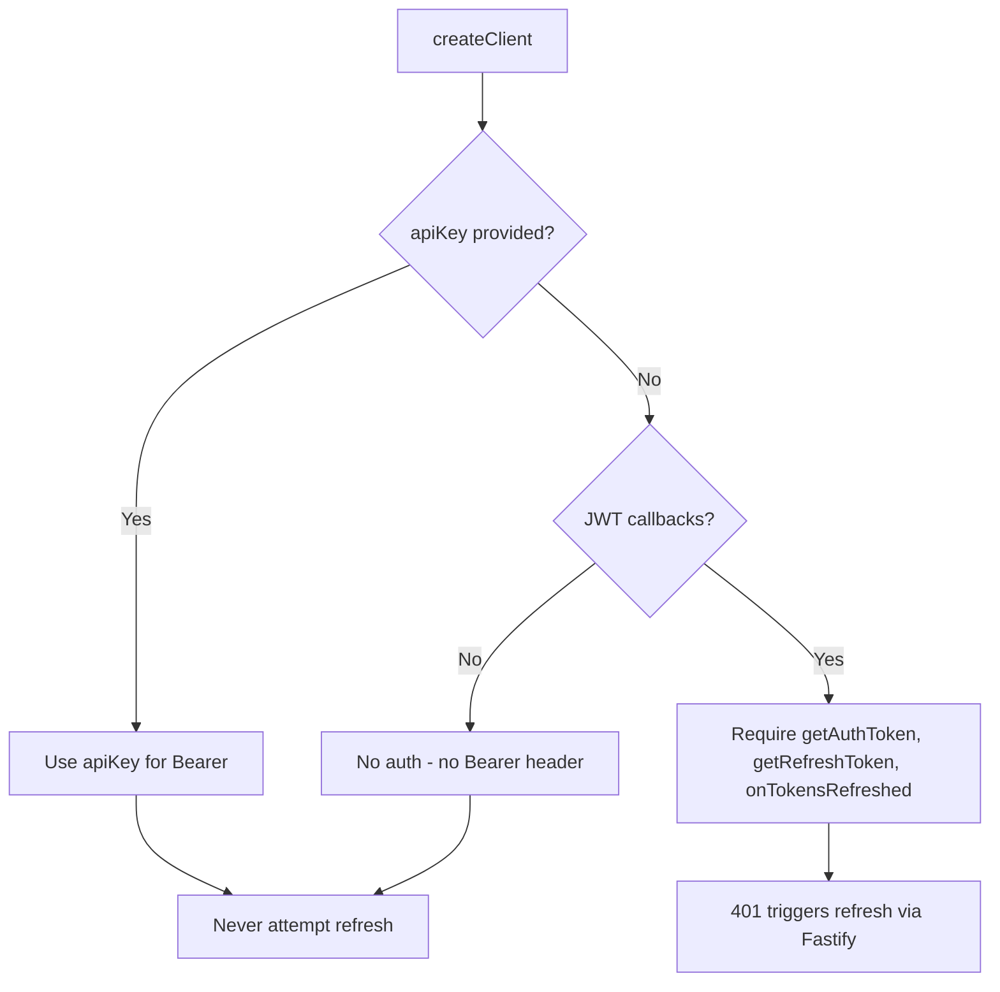
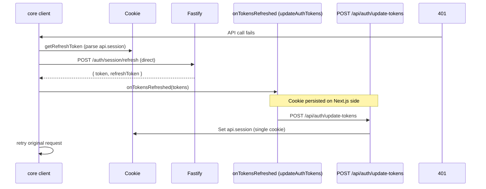
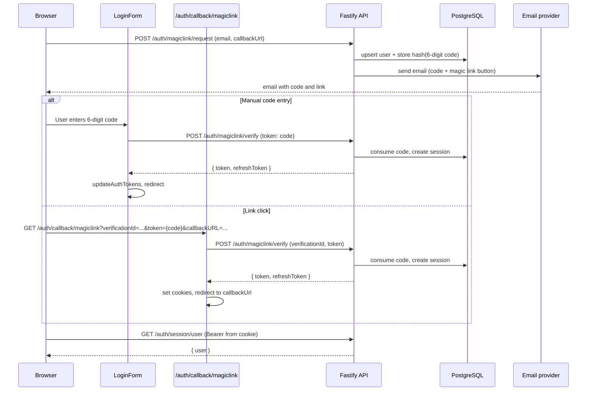

## Goals

- **Framework-agnostic @repo/react**: Token from cookie, no Next.js-specific APIs. Works with Vue, Svelte, or vanilla browser.
- **Standardized auth flow**: All methods (magic link, OAuth, Web3) follow the same login pattern and share one token refresh path.
- **No Fastify proxy**: Clients call Fastify directly (`NEXT_PUBLIC_API_URL`). Next.js API exists only for cookie updates (update-tokens). Core client calls Fastify `POST /auth/session/refresh` directly on 401.
- **Minimize Next.js API**: Prefer auth pages (callbacks, logout) over API routes.

## Overview

Authentication is implemented in `apps/api` as a **JWT Bearer** system backed by **Drizzle + PostgreSQL/PGLite** session state.

We use JWTs to support **all client types** (web, mobile, desktop, servers, CLIs) with a single, standard `Authorization: Bearer` integration.

It supports:

- **Magic link**: passwordless email sign-in
- **OAuth**: sign in with providers
- **Web3**: sign in with wallets
- **API keys**: programmatic auth for servers, CLIs, and scripts (alternate Bearer format)
- **TOTP**: authenticator app (e.g. Google Authenticator) for one-time codes
- **Passkeys**: WebAuthn passkeys for passwordless sign-in (registration and sign-in)

## Principles

- **Backend-controlled**: authentication is verified server-side
- **JWT Bearer**: the API accepts `Authorization: Bearer <accessToken>` (JWT) or `Authorization: Bearer venc_<prefix>_<secret>` (API key)
- **Access + refresh tokens**: short-lived access JWTs, rotated refresh JWTs
- **DB-backed sessions**: tokens reference a session id that can be revoked
- **Callback pages**: Next.js auth pages (`/auth/callback/*`, `/auth/logout`) set cookies; clients call Fastify directly for user data

## Authentication methods

### API keys (implemented)

API keys enable programmatic auth for servers, CLIs, and scripts. Users create keys from the dashboard (or via JWT-authenticated endpoints); the full key is shown once at creation and cannot be retrieved later.

- **Format**: `venc_<prefix>_<secret>` (stored as prefix + SHA256 hash of secret)
- **Usage**: `X-API-Key: venc_<prefix>_<secret>` or `Authorization: Bearer venc_<prefix>_<secret>` — same header as JWT; Fastify distinguishes by prefix
- **Endpoints** (Bearer required — JWT or API key): `POST /account/apikeys` (create), `GET /account/apikeys` (list), `DELETE /account/apikeys/:id` (revoke)
- **Security**: timing-safe hash comparison; secrets hashed at rest; `lastUsedAt` nullable (null = never used)

### TOTP authenticator (implemented)

TOTP enables users to add an authenticator app (e.g. Google Authenticator, Authy) for one-time codes. One TOTP factor per user.

- **Setup flow**: `POST /account/link/totp/setup` → returns `{ otpauthUri, manualEntryKey, qrCodeDataUrl }` → user scans QR or enters key → `POST /account/link/totp/verify` with `{ code }` → persists to `totp` table
- **Unlink**: `DELETE /account/link/totp` → removes TOTP for user
- **Session user**: `GET /auth/session/user` includes `totpEnabled: boolean`
- **Error codes**: `INVALID_CODE`, `EXPIRED_SETUP`

### Passkeys (implemented)

Passkeys use WebAuthn for passwordless registration and sign-in. Registration creates discoverable credentials (`residentKey: 'required'`) so passkeys sync to iCloud Keychain, Google Password Manager, 1Password, etc. rpID is derived from the request `Origin` header (validated against `ALLOWED_ORIGINS`).

**Registration** (when logged in):

- **Add passkey**: `POST /account/link/passkey/start` → returns `{ options }` for `startRegistration` → client calls `POST /account/link/passkey/finish` with `{ credential, name? }` — optional name for display
- **List**: `GET /account/passkeys` → `{ passkeys: [{ id, name, createdAt }] }`
- **Remove**: `DELETE /account/link/passkey/:id`
- **Session user**: `GET /auth/session/user` includes `passkeys` array
- **Stored metadata**: `transports` (JSONB), `credentialDeviceType`, `credentialBackedUp` for cross-device UX
- **Error codes**: `INVALID_ORIGIN`, `EXPIRED_CHALLENGE`, `VERIFICATION_FAILED`

**Sign-in** (username-less flow):

- **Start**: `POST /auth/passkey/start` (no auth) → returns `{ options, sessionId }` for `startAuthentication`
- **Verify**: `POST /auth/passkey/verify` with `{ assertion, sessionId, callbackUrl? }` → creates session, returns `{ redirectUrl }` or `{ token, refreshToken }`
- **Exchange**: `POST /auth/passkey/exchange` with `{ code }` → one-time code for tokens (callback flow)
- **Tables**: `passkey_auth_challenges` (sessionId, challenge, 5 min TTL), `passkey_callback` (codeHash, tokens, one-time consumption)
- **Flow**: Client calls start → stores sessionId → `startAuthentication` → verify with sessionId in body → `window.location.assign(redirectUrl)` → callback page exchanges code, sets cookies, redirects
- **Error codes**: `INVALID_ORIGIN`, `EXPIRED_CHALLENGE`, `UNKNOWN_CREDENTIAL`, `VERIFICATION_FAILED`, `INVALID_CALLBACK_URL`

**Vercel-style discovery UX** (optional):

- **Resolve user**: `POST /auth/passkey/resolve-user` with `{ userHandle }` (base64url from assertion) → returns `{ maskedIdentifier }` for "Login as …" display (PII-safe). Rate limited (10/min per IP).
- **Discovery flow**: On login page load, client calls start → `startAuthentication({ useBrowserAutofill: true })` (conditional UI) → if credential returned, call resolve-user with `response.userHandle` → show `PasskeyShortcut` card above the form.
- **PasskeyShortcut**: Compact card with "Login as [email]", [Use Passkey] button, "Use another method" link. When user clicks "Use Passkey", verify without `callbackUrl` → receive `{ token, refreshToken }` → `updateAuthTokens` + `router.push`.
- **Direct token flow**: When `callbackUrl` is absent, verify returns `{ token, refreshToken }` directly (no redirect). Caller uses `onSuccess` to update cookies and navigate.
- **Fallback**: When discovery finds nothing, passkey remains in "Or continue with" (redirect flow).

### Magic link (implemented)

Magic link sign-in issues a **6-digit login code** over email, then exchanges it for JWTs. Users can either type the code into the login form or click the magic link button in the email.

**Flow:**
1. User enters email → `POST /auth/magiclink/request` → email sent with subject `{code} - {APP_NAME} verification code`
2. Email contains the 6-digit code prominently and a "Sign in" button (magic link)
3. **Option A (manual):** User types the 6-digit code in the login form → `POST /auth/magiclink/verify` with `{ token: code }` → JWTs returned
4. **Option B (link):** User clicks the button in email → callback page receives `?verificationId=...&token={code}` → verify → cookies set, redirect

### Change email (implemented)

Change email follows the same 6-digit + link pattern as magic link. User requests change, receives code and link in email, verifies via code entry or link click.

**Flow:**
1. User enters new email → `POST /account/email/change/request` (Bearer, body: `{ email, callbackUrl }`) → rate limited 3/hour per user
2. Email contains 6-digit code and link; identifier `userId:newEmail`; 15 min TTL
3. **Code entry:** `POST /account/email/change/verify` with `{ token, email }` (Bearer)
4. **Link click:** User hits `/auth/callback/change-email?token=&verificationId=` → callback verifies with Bearer, sets cookies, redirects `/settings?email_changed=ok`
5. On success: `users.email` updated, session rotated, old-email notification sent (fire-and-forget)

**Verify payload modes:** Exactly one of `{ token, email }` or `{ token, verificationId }`. Auth attempts type `change_email` (5 fail → 15 min lock).

**Callback without session:** Redirect to `/auth/login?redirect=...`; after login, user returns to callback with session and verifies.

### OAuth (GitHub)

OAuth sign-in uses provider authorization + callback flows and issues access + refresh JWTs. Provider accounts are stored in `account` (provider id, account id, and encrypted tokens at rest).

**GitHub OAuth flow:**

1. User clicks "Continue with GitHub" → client calls `useOAuthLogin` → `GET /auth/oauth/github/authorize-url` (direct to Fastify) → receives `{ redirectUrl }` → redirects to GitHub
2. User authorizes on GitHub → GitHub redirects to callback URL with `?code=&state=`
3. Callback page (`/auth/callback/oauth/github`) calls `POST /auth/oauth/github/exchange` with `{ code, state }` → Fastify returns `{ token, refreshToken }`
4. Callback page sets cookies and redirects to `/`

**Setup:** Create a [GitHub OAuth App](https://github.com/settings/applications/new). Set callback URL(s) to match your env. Add `GITHUB_CLIENT_ID`, `GITHUB_CLIENT_SECRET`, and either `OAUTH_GITHUB_CALLBACK_URL` (single) or `OAUTH_GITHUB_CALLBACK_URLS` (comma-separated) to Fastify env.

### OAuth (Google, Facebook, Twitter)

All OAuth providers support optional `redirect_uri` on authorize-url and link-authorize-url. When provided, it must exactly match one of the configured callback URLs. Default = first URL in the list. Use `OAUTH_*_CALLBACK_URLS` (comma-separated) for web + mobile; `OAUTH_*_CALLBACK_URL` (single) for backward compatibility.

**Google:** Two flows. **(1) One Tap (primary):** Uses [Google Identity Services](https://developers.google.com/identity/gsi/web) (GIS). Popup in top-right when user is logged into Google. Client POSTs `{ credential }` to `POST /auth/oauth/google/verify-id-token`. **(2) Redirect (fallback + linking):** When One Tap is blocked/dismissed or for account linking. `GET /auth/oauth/google/authorize-url?redirect_uri=` (optional) → callback → `POST /auth/oauth/google/exchange`. **Setup:** One Tap: `GOOGLE_CLIENT_ID`, `NEXT_PUBLIC_GOOGLE_CLIENT_ID`. Redirect/linking: add `GOOGLE_CLIENT_SECRET`, and either `OAUTH_GOOGLE_CALLBACK_URL` (single) or `OAUTH_GOOGLE_CALLBACK_URLS` (comma-separated).

**Facebook:** Redirect flow. `GET /auth/oauth/facebook/authorize-url?redirect_uri=` (optional) → `POST /auth/oauth/facebook/exchange`. Callback: `/auth/callback/oauth/facebook`. **Setup:** `FACEBOOK_CLIENT_ID`, `FACEBOOK_CLIENT_SECRET`, `OAUTH_FACEBOOK_CALLBACK_URL` or `OAUTH_FACEBOOK_CALLBACK_URLS`.

**Twitter (X):** OAuth 2.0 with PKCE. `GET /auth/oauth/twitter/authorize-url?redirect_uri=` (optional) → `POST /auth/oauth/twitter/exchange`. Callback: `/auth/callback/oauth/twitter`. **Setup:** `TWITTER_CLIENT_ID`, `TWITTER_CLIENT_SECRET`, `OAUTH_TWITTER_CALLBACK_URL` or `OAUTH_TWITTER_CALLBACK_URLS`.

**Provider console pitfalls:** Redirect URI must match exactly (no prefix, partial, or wildcard). Watch for trailing slash, HTTPS vs HTTP, and mobile scheme restrictions. Add each URL to the provider's allowed callback list.

When a provider is not configured (503 `OAUTH_NOT_CONFIGURED`), the client shows a Sonner toast instead of redirecting.

### OAuth account linking (implemented)

Logged-in users can link additional OAuth providers from Profile (Settings). Flow: `GET /auth/oauth/{provider}/link-authorize-url` (session/JWT required, no API key) → redirect to provider → callback → exchange with `oauth_link_state` → link account, return `{ token, refreshToken, redirectTo: "/settings?linked=ok" }`.

- **Link-authorize-url:** Session/JWT required, no API key; rate limit 10/hour per user. Stores `oauth_link_state` with `meta.userId`, `meta.redirectUri`. All providers accept optional query `redirect_uri` (must be in configured callback URLs).
- **Exchange:** State lookup branches on `oauth_link_state` vs `oauth_state`. Link mode uses `meta.userId`; if provider already linked to another user → 409 `PROVIDER_ALREADY_LINKED`.
- **Unlink:** `DELETE /account/link/oauth/:providerId` (Bearer). Guardrail: cannot unlink if it would leave no sign-in method (400 `LAST_SIGN_IN_METHOD`).
- **Session user:** `GET /auth/session/user` returns `linkedAccounts: [{ providerId }]`.

See [Account linking](/docs/architecture/account-linking) for change email vs link email, provider trust, and guardrails.

### Web3 (SIWE / SIWS)

Web3 sign-in follows a **nonce → sign → verify** flow and returns access + refresh JWTs. Nonce and verify requests go **directly to Fastify**; the **callback** (token → cookie exchange) goes through the Next.js backend when cookies are needed.

- **EIP-155 (SIWE)**: Sign-In with Ethereum using EIP-4361
- **Solana (SIWS)**: Sign-In with Solana using an EIP-4361-style message format

**Flow:** Client fetches nonce → builds message → signs with wallet → POSTs verify to Fastify with optional `callbackUrl`. When `callbackUrl` is set: Fastify returns 302 to callback with one-time `code` → callback page exchanges code via `POST /auth/web3/exchange` → sets cookies and redirects. When absent: Fastify returns JSON `{ token, refreshToken }` (mobile/CLI).

**Framework support:** Wallet integration lives in `apps/web` (`@/hooks/`, `@/wallet/`). `@repo/react` exposes verify hooks: `useVerifyWeb3Auth`, `useVerifyLinkWallet`. Pass `callbackUrl` to `useVerifyWeb3Auth().mutate()` for redirect flow.

**WalletAdaptersInjector:** In `apps/web`, mount `WalletAdaptersInjector` inside providers. Triggers sign-out on wallet disconnect (redirects to `/auth/logout`).

**Error codes:** `INVALID_NONCE`, `EXPIRED_NONCE`, `INVALID_SIGNATURE` for consistent UI handling. Wallet rejection (e.g. user denies signing) is surfaced as a non-fatal error. Account link: `WALLET_ALREADY_LINKED`, `EMAIL_ALREADY_IN_USE`, `EXPIRED_TOKEN`.

**JWT cookie refresh:** After link email or profile edit, the client receives `{ token, refreshToken }` from the verify endpoint. Call `POST /api/auth/update-tokens` with those values to update cookies. In `apps/web`, use `updateAuthTokens` from `@/lib/auth-client`.

**Data model:** Nonces are stored in `web3_nonce` (5-min TTL); identities in `wallet_identities`.



### Provider / adapter architecture

```mermaid
flowchart TB
  subgraph App [apps/web]
    WAI[WalletAdaptersInjector]
    Providers[providers.tsx]
  end

  subgraph Wagmi [wagmi]
    useAccount
    useSignMessage
  end

  subgraph Solana [Solana wallet-adapter]
    useWallet
  end

  subgraph AppHooks [apps/web @/hooks @/wallet]
    WalletProvider
    useWalletAuth
    useLinkWallet
  end

  subgraph RepoReact [@repo/react]
    useVerifyWeb3Auth
    useVerifyLinkWallet
    useLinkEmail
  end

  Providers --> WAI
  WAI -->|bridges| Wagmi
  WAI -->|bridges| Solana
  WAI --> WalletProvider
  WalletProvider --> useWalletAuth
  WalletProvider --> useLinkWallet
  useWalletAuth --> useVerifyWeb3Auth
  useLinkWallet --> useVerifyLinkWallet
```

### Dashboard link flows



## Tokens & sessions

### Access token (JWT)

- **Type**: `typ = "access"`
- **Claims**: `sub` (user id), `sid` (session id), `wal` (optional session wallet when JWT created by wallet sign-in), `iss`, `aud`
- **Lifetime**: `ACCESS_JWT_EXPIRES_IN_SECONDS`
- **Validation**: Fastify verifies the JWT, then loads the session + user from DB and attaches `request.session`

### Refresh token (JWT)

- **Type**: `typ = "refresh"`
- **Claims**: `sub` (user id), `sid` (session id), `jti` (refresh token id), `iss`, `aud`
- **Lifetime**: `REFRESH_JWT_EXPIRES_IN_SECONDS`
- **Rotation**: `POST /auth/session/refresh` returns a new access+refresh pair

Refresh token reuse is detected by hashing the `jti` and comparing it to the stored session token hash. On reuse, the session is revoked.

### Session lifecycle

- **Create**: magic link verification creates a session and stores a hash of the refresh `jti`
- **Refresh**: refresh rotates `jti` and extends session expiry
- **Revoke**: logout deletes the session (and refresh reuse detection revokes)



## Endpoints

All endpoints below are served by `apps/api`. The API does not set cookies; tokens are returned as JSON.

- **Magic link**
  - `POST /auth/magiclink/request` → `{ ok }`
  - `POST /auth/magiclink/verify` → `{ token, refreshToken }`
- **OAuth (GitHub)**
  - `GET /auth/oauth/github/authorize-url` → `{ redirectUrl }` (optional query: `redirect_uri`)
  - `GET /auth/oauth/github/authorize` → 302 redirect to GitHub (legacy; optional query: `redirect_uri`)
  - `POST /auth/oauth/github/exchange` → `{ token, refreshToken }` (body: `{ code, state }`)
- **OAuth (Google One Tap)**
  - `POST /auth/oauth/google/verify-id-token` → `{ token, refreshToken }` (body: `{ credential }`)
- **OAuth (Google redirect)** — fallback + linking
  - `GET /auth/oauth/google/authorize-url` → `{ redirectUrl }` (optional query: `redirect_uri` — must be in allowlist)
  - `POST /auth/oauth/google/exchange` → `{ token, refreshToken, redirectTo? }` (body: `{ code, state }`)
- **OAuth (Facebook)**
  - `GET /auth/oauth/facebook/authorize-url` → `{ redirectUrl }` (optional query: `redirect_uri`)
  - `POST /auth/oauth/facebook/exchange` → `{ token, refreshToken }` (body: `{ code, state }`)
- **OAuth (Twitter)**
  - `GET /auth/oauth/twitter/authorize-url` → `{ redirectUrl }` (PKCE; optional query: `redirect_uri`)
  - `POST /auth/oauth/twitter/exchange` → `{ token, refreshToken }` (body: `{ code, state }`)
- **Web3**
  - `GET /auth/web3/nonce` → `{ nonce }` (query: `chain`, `address`)
  - `POST /auth/web3/:chain/verify` → `{ token, refreshToken }`
  - `:chain` is `eip155` or `solana`
- **Change email** (Bearer required)
  - `POST /account/email/change/request` → `{ ok }` (body: `email`, `callbackUrl`), rate limit 3/hour
  - `POST /account/email/change/verify` → `{ token, refreshToken }` (body: `{ token, email }` or `{ token, verificationId }`)
- **Account linking** (Bearer required — JWT or API key, except link-authorize-url)
  - `POST /account/link/wallet/verify` → `{ ok }` (body: `chain`, `message`, `signature`)
  - `DELETE /account/link/wallet/:id` → `204` (unlink wallet by id from `linkedWallets`)
  - `POST /account/link/email/request` → `{ ok }` (body: `email`, `callbackUrl`)
  - `POST /account/link/email/verify` → `{ token, refreshToken }` (body: `token`)
  - `GET /auth/oauth/{github,google,facebook,twitter}/link-authorize-url` → `{ redirectUrl }` (Session required; optional query `redirect_uri` for all providers; rate limit 10/hour)
  - `DELETE /account/link/oauth/:providerId` → `204` (unlink OAuth provider)

**Account link error codes**: `WALLET_ALREADY_LINKED`, `EMAIL_ALREADY_IN_USE`, `PROVIDER_ALREADY_LINKED`, `LAST_SIGN_IN_METHOD`

- **API keys** (Bearer required — JWT or API key)
  - `POST /account/apikeys` → `{ id, name, key, prefix, createdAt }` (key shown once)
  - `GET /account/apikeys` → `{ keys: [{ id, name, prefix, lastUsedAt, expiresAt, createdAt }] }`
  - `DELETE /account/apikeys/:id` → `204`

- **TOTP** (Bearer required)
  - `POST /account/link/totp/setup` → `{ otpauthUri, manualEntryKey, qrCodeDataUrl }`
  - `POST /account/link/totp/verify` → `{ ok }` (body: `{ code }`)
  - `DELETE /account/link/totp` → `204`

- **Passkeys** (Bearer required for registration)
  - `POST /account/link/passkey/start` → `{ options }` (for `startRegistration`)
  - `POST /account/link/passkey/finish` → `{ ok }` (body: `{ credential }`)
  - `GET /account/passkeys` → `{ passkeys: [{ id, name, createdAt }] }`
  - `DELETE /account/link/passkey/:id` → `204`

- **Passkey sign-in** (no auth)
  - `POST /auth/passkey/start` → `{ options, sessionId }`
  - `POST /auth/passkey/verify` → `{ redirectUrl }` or `{ token, refreshToken }` (body: `{ assertion, sessionId, callbackUrl? }`)
  - `POST /auth/passkey/resolve-user` → `{ maskedIdentifier }` (body: `{ userHandle }`, for discovery UX)
  - `POST /auth/passkey/exchange` → `{ token, refreshToken }` (body: `{ code }`)

- **Session**
  - `GET /auth/session/user` (Bearer) → `{ user }` (includes optional `wallet`, `linkedWallets`, `linkedAccounts` with `{ providerId }`, `totpEnabled`, `passkeys` with `{ id, name, createdAt }`)
  - `POST /auth/session/logout` (Bearer) → `204`
  - `POST /auth/session/refresh` → `{ token, refreshToken }`

## Next.js Auth (web)

**Callback pages** (`/auth/callback/magiclink`, `/auth/callback/change-email`, `/auth/callback/oauth/github`, `/auth/callback/oauth/google`, `/auth/callback/oauth/facebook`, `/auth/callback/oauth/twitter`, `/auth/callback/web3`, `/auth/callback/passkey`) exchange credentials with Fastify, set cookies, and redirect. **Logout** (`/auth/logout`) calls Fastify to revoke the session and clears cookies.

**API routes** (cookie updates only):
- `POST /api/auth/update-tokens`: accepts `{ token, refreshToken }`, sets single cookie. Used after 401 refresh (core's `onTokensRefreshed`) and after link email or profile edit.

**Proxy vs coreClient refresh**: The proxy (`proxy.ts`) runs on navigation before React mounts—it refreshes expired tokens so the user isn’t redirected to login. The core client runs on client-side 401 (e.g. `useUser`)—it calls Fastify `POST /auth/session/refresh` directly, then `onTokensRefreshed` POSTs to `/api/auth/update-tokens` to persist new tokens in the cookie. Both are needed.

**Route protection**: Proxy handles all auth redirects. Do not duplicate `getAuthStatus()` + redirect in layouts or pages.

**Cookies**: Single cookie `api.session` (configurable via `AUTH_COOKIE_NAME` / `NEXT_PUBLIC_AUTH_COOKIE_NAME`) stores JSON `{ token, refreshToken }`. Readable on the client (`httpOnly: false`) so `getAuthToken` can read from `document.cookie`. Cookie `maxAge` is derived from refresh JWT `exp`.

**Core auth modes**: `createClient` supports three modes—(1) **apiKey**: static Bearer, no refresh; (2) **JWT**: `getAuthToken`, `getRefreshToken`, `onTokensRefreshed` required, refresh on 401; (3) **no-auth**: `baseUrl` only.

### Cookie architecture

```mermaid
flowchart TB
  subgraph Storage [Single Cookie]
    Session["api.session"]
  end

  subgraph Parse [Parse JSON]
    Session -->|"value"| Parse
    Parse --> Access["token"]
    Parse --> Refresh["refreshToken"]
  end

  Access --> getAuthToken["getAuthToken returns token"]
  Refresh --> getRefreshToken["getRefreshToken returns refreshToken"]
  getAuthToken --> Bearer["Authorization: Bearer"]
```

### Core auth mode decision flow



### JWT 401 refresh sequence

Core calls Fastify directly for refresh; Next.js cookie updated via `onTokensRefreshed` → `update-tokens`.



## Magic link flow (web)

A 6-digit code is sent by email. Users can enter the code on the login page or click the magic link in the email. Both paths exchange the code for JWTs.



## Session vs user data

- **useSession** (`@repo/react`): Returns decoded JWT claims (`sub`, `sid`, `exp`, `wal`). No API call—reads token from cookie, decodes client-side. Use for auth gates and identity checks.
- **useUser** (`@repo/react`): Calls Fastify `GET /auth/session/user` directly with Bearer from cookie. Use for email, display name, `linkedWallets`.

## Data model (Drizzle)

The auth system relies on these tables:

- **`users`**: user identity (email-based for magic link)
- **`verification`**: single-use tokens (stored hashed, with TTL); `type` = `magic_link` | `link_email` | `oauth_state` | `change_email` | `oauth_link_state`
- **`sessions`**: server-side session state (stores hashed refresh `jti`, expiry, optional `wallet_chain`/`wallet_address` for wallet sessions)
- **`account`**: OAuth provider accounts (provider id + encrypted tokens at rest)
- **`wallet_identities`**: Web3 identities (`eip155`/`solana` + normalized address)
- **`api_keys`**: user-scoped API keys (prefix, hashed secret, optional `lastUsedAt`, `expiresAt`)
- **`totp`**: user TOTP secret (encrypted at rest); one per user
- **`totp_setup`**: temporary TOTP setup (encrypted secret, 10-min TTL); replaced on new setup
- **`passkey_credentials`**: WebAuthn credentials (credentialId, publicKey, counter, name, transports, credentialDeviceType, credentialBackedUp)
- **`passkey_challenges`**: registration challenges (challenge, 5-min TTL)
- **`passkey_auth_challenges`**: sign-in challenges (sessionId, challenge, 5-min TTL)
- **`passkey_callback`**: one-time code exchange (codeHash, tokens, 5-min TTL, consumed on exchange)

## Security notes

- **Refresh token rotation**: refresh `jti` is rotated on every refresh; reuse revokes the session
- **Hashed secrets at rest**: magic link tokens, refresh `jti`, and API key secrets are stored hashed
- **API key security**: timing-safe hash comparison, optional expiry, atomic revoke with ownership check
- **Callback URL safety**: `callbackUrl` is validated with `isAllowedUrl` against `ALLOWED_ORIGINS` (default `*`). Absolute `http`/`https` only; invalid schemes (e.g. `javascript:`), relative URLs, and disallowed origins are rejected
- **OAuth tokens encrypted at rest**: provider access/refresh tokens are stored encrypted (AES-256-GCM)
- **Nonce-based Web3 verification**: nonces are short-lived and prevent replay attacks
- **Environment validation**: auth/security env vars are validated via Zod (`@t3-oss/env-core`)
