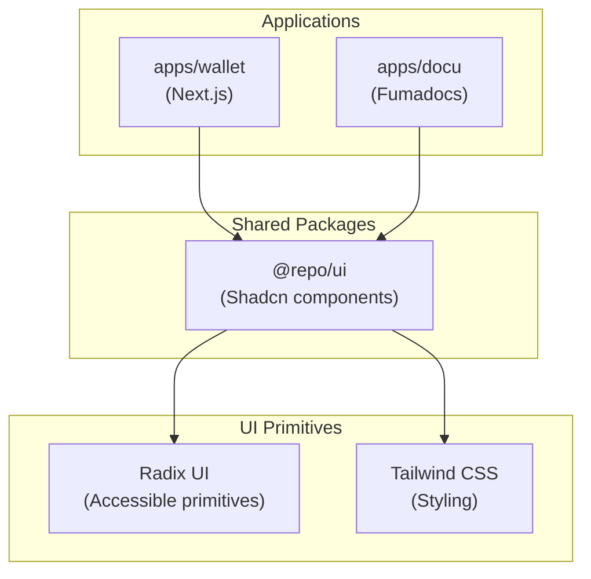

## Overview

Frontend applications use **Next.js** with the **Shadcn/ui** component library and **Tailwind CSS**. This combination enables rapid AI-assisted development through v0 integration while maintaining full component ownership.

## Technology Choices

### Framework: Next.js

**Next.js** provides a full-stack React framework with:

- ✅ **React Server Components** - Modern React patterns with server-side rendering
- ✅ **App Router** - File-based routing with layouts and nested routes
- ✅ **Turbopack** - Fast builds and development server
- ✅ **Built-in optimizations** - Image optimization, font optimization, code splitting
- ✅ **TypeScript support** - Excellent type safety out of the box
- ✅ **Monorepo integration** - Works seamlessly with Turborepo and pnpm workspaces

### Design System: Shadcn/ui + Tailwind CSS

**Shadcn/ui** is a copy-paste component library built on:

- ✅ **Component ownership** - Components copied into codebase, full control
- ✅ **No vendor lock-in** - No external dependency versioning
- ✅ **v0 integration** - Seamless workflow from AI-generated prototypes to production
- ✅ **Radix UI primitives** - Accessible components by default
- ✅ **Tailwind CSS** - Utility-first CSS for rapid styling
- ✅ **Customizable** - Easy to modify and extend components

## Why v0 Integration Matters

**v0** (Vercel's AI UI generator) was a key factor in choosing Next.js + Shadcn/ui:

- v0 generates **Next.js + Shadcn/ui** components
- Enables rapid prototyping with AI assistance
- Seamless workflow: AI prototype → production code
- Components are immediately usable and customizable

This integration accelerates development by allowing AI to generate production-ready UI components that follow our design system.

## Component Architecture



## Component Organization

Components are organized in the `@repo/ui` package:

- **Base components** - Button, Input, Card, etc. (from Shadcn/ui)
- **Custom components** - Domain-specific components built on base
- **Shared across apps** - Used by `apps/wallet`, `apps/mathler`, `apps/docu`, and other frontend apps

## Development Workflow

1. **AI prototyping** - Use v0 to generate component ideas
2. **Component discovery** - Use MCP servers for component discovery and installation:
   - Use `shadcnui-official` MCP for component variants and props reference
   - Use `shadcnui-jpisnice-react` MCP for full page/block templates
3. **Component copy** - Copy Shadcn/ui components into `@repo/ui`
4. **Customization** - Modify components to match design requirements
5. **Usage** - Import components in Next.js apps
6. **Sharing** - Components available across all frontend apps

## Styling with Tailwind CSS

**Tailwind CSS** provides:

- **Utility-first** - Rapid styling with utility classes
- **Design tokens** - Consistent spacing, colors, typography
- **Responsive design** - Mobile-first breakpoints
- **Dark mode** - Built-in dark mode support
- **Performance** - Only includes used styles in production bundle

## TypeScript Integration

Full type safety throughout:

- **Component props** - Fully typed component interfaces
- **Next.js routes** - Type-safe routing with App Router
- **API clients** - Type-safe API calls via generated hey-api clients
- **Shared types** - Domain types from `@repo/core`

## Core Libraries

### Data Fetching & State Management

- **@tanstack/react-query**: Primary data fetching solution
  - Use `@lukemorales/query-key-factory` for centralized query keys
- **@repo/react**: Generated React Query hooks from Hey API clients
  - Hooks generated from OpenAPI spec (which is generated from Fastify routes)
  - Full type safety from routes to components
- **nuqs**: URL-based state for shareable UI state (filters, search, tabs, pagination)

### Ethereum Integration

- **viem**: Low-level Ethereum interactions
- **wagmi**: React hooks for Ethereum (built on react-query and viem)

### Validation & Type Safety

- **zod**: Primary schema validation tool (CRITICAL)
  - Use `z.infer<typeof schema>` for type inference
  - Use `@repo/lib` utilities: `parseJsonWithSchema`, `formatZodError`, `formatZodErrors`, `isZodError`
- **Hey API generated clients**: Type-safe API clients generated from OpenAPI specs
  - Use `createApi` from `@repo/core` for type-safe API calls
  - Clients generated by Hey API from OpenAPI spec (which is generated from Fastify routes)
  - React Query hooks generated in `@repo/react` from the same OpenAPI spec

### Authentication & Actions

- **@dynamic-labs/sdk-react-core**: Multi-chain wallet authentication with JWT
- **next-safe-action**: Type-safe server actions with ActionResult pattern

### Error Handling

- **react-error-boundary**: Use `ErrorBoundary` and `useErrorHandler` for async errors

### Utility Libraries

- **@repo/lib**: Prefer over custom implementations
  - Async: `delay` (replace `setTimeout`), `fetchWithTimeout` (replace `fetch` for external APIs)
  - Error: `getErrorMessage`, `formatZodError`, `formatZodErrors`, `sanitizeErrorMessage`, `isZodError`
  - Zod: `parseJsonWithSchema` (JSON parsing with validation)
  - Date: `getDateKey`
  - Env: `getEnvHelper` (Next.js), `validateEnvOrThrow` (server apps)
- **react-use**: Use `useAsyncFn` for one-off async operations (not data fetching)
- **nanoid**: Unique ID generation
- **lodash-es**: Prefer over custom implementations for common operations (ESM version for tree-shaking)
  - Array: `isEmpty`, `uniq`, `groupBy`, `chunk`
  - Object: `merge`, `pick`, `omit`, `isPlainObject`
  - Type checking: `isString`, `isNumber`, `isEmpty`, `isPlainObject`, `isArray`
  - String: `camelCase`, `kebabCase`, `startCase`
  - Functional: `debounce`, `throttle`, `memoize`
  - Use per-function imports: `import isEmpty from 'lodash-es/isEmpty'` and `import debounce from 'lodash-es/debounce'`

## Usage Patterns

### Query Key Factory Pattern

```tsx
// src/queries/users.ts
import { createQueryKeys } from '@lukemorales/query-key-factory'

export const users = createQueryKeys('users', {
  detail: (id: string) => ({
    queryKey: [id],
    queryFn: () => fetchUser(id),
  }),
})

// Usage
import { useQuery } from '@tanstack/react-query'
import { users } from '@/queries/users'

const { data } = useQuery(users.detail(userId))
```

### nuqs URL State

```tsx
import { useQueryState, parseAsString, parseAsInteger } from 'nuqs'

// Single state
const [search, setSearch] = useQueryState('q', parseAsString.withDefault(''))

// Multiple states
const [filters, setFilters] = useQueryStates({
  search: parseAsString.withDefault(''),
  page: parseAsInteger.withDefault(1),
})
```

### Server Actions Pattern

```tsx
'use server'
import { type ActionResult, success, failure } from '@repo/wallet'
import { createSafeActionClient } from 'next-safe-action'

export const saveAction = createSafeActionClient()
  .schema(actionSchema)
  .action(async ({ parsedInput }): Promise<ActionResult<T>> => {
    try {
      return success(result)
    } catch (error) {
      return failure({ code: 'UNEXPECTED_ERROR', error, label: 'saveAction' })
    }
  })
```

### API Client Usage

Use generated clients from `@repo/core` and `@repo/react`:

```typescript
import { createApi } from '@repo/core'
import { useHealthCheck } from '@repo/react'

// Runtime-agnostic client
const api = createApi({
  baseUrl: process.env.NEXT_PUBLIC_API_URL!,
  getAuthToken: async () => session?.token,
})

// Fully typed API call
const health = await api.healthCheck()

// Or use generated React Query hooks
const { data, isLoading, error } = useHealthCheck()
```

Clients are generated by Hey API from OpenAPI specs, which are generated from Fastify routes.

## Best Practices

- Use Query Key Factory for all TanStack Query keys
- Use nuqs for URL-shareable state (filters, search, tabs, pagination)
- Use TanStack Query's built-in state (`isLoading`, `isError`) - never manually manage
- Use `useSetState` for grouped state not in URL (game engine, form state)
- Prefer lodash over custom implementations
- Prefer `@repo/lib` utilities over custom implementations
- Use Hey API generated clients for type-safe API calls (end-to-end type safety from Fastify routes → OpenAPI → generated clients)
- Mobile-first design

## Concurrent Rendering

React's **Fiber architecture** is always active in React 19.2.3 (used in Next.js 16), enabling concurrent rendering features. These features allow React to work on multiple UI versions simultaneously, interrupt non-urgent updates, prioritize user interactions, and stream content progressively.

**Available Features**:
- **Suspense**: Automatic for Server Components via `loading.tsx` files, manual boundaries for Client Components with async operations
- **Transitions** (`useTransition`): Mark non-urgent updates to keep UI responsive during heavy rendering
- **Deferred Values** (`useDeferredValue`): Defer expensive computations while keeping previous value visible

**Key Benefits**:
- Better perceived performance through progressive streaming
- Responsive UI during heavy rendering (inputs stay interactive)
- Smoother interactions (transitions prevent UI blocking)
- Progressive enhancement (show critical content first, enhance later)

**When to Use**:
- **Suspense**: Async operations, progressive page loading with multiple boundaries
- **Transitions**: Search/filter inputs, tab switching, heavy state updates
- **Deferred Values**: Expensive filtering/computation that can be deferred

**React Compiler**: Not recommended yet - wait 3-6 months for better ecosystem support. While React Compiler (v1.0) offers automatic memoization, it adds build complexity, has library compatibility issues, and can introduce breaking behavior changes.

For detailed patterns and examples, see the [Next.js 16 App Router skill](/docs/getting-started/cursor-setup) (concurrent rendering section).

## Development Tools

- **@tanstack/react-query-devtools**: Add conditionally in development only

## Optional Packages (Add When Needed)

- **@tanstack/query-sync-storage-persister**: Persist queries to localStorage
- **@tanstack/virtual**: Virtual scrolling for large lists (1000+ items)
- **@tanstack/react-table**: Complex data tables
- **@ai-sdk/react**: AI chat functionality with streaming
- **ai-elements**: Vercel AI Elements components

## Related Documentation

- [Monorepo Structure](/docs/core-concepts/monorepo-structure) - Package organization
- [Packages Reference](/docs/core-concepts/packages) - TanStack Query hooks reference
