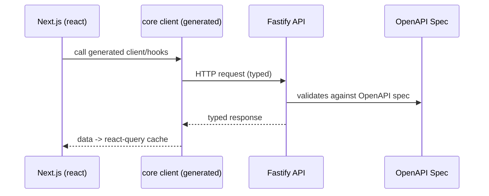

## Overview

This document defines the conventions and package architecture for a **TypeScript + ESM** monorepo that uses:

* **Fastify** (server)
* **OpenAPI** (API contracts)
* **hey-api** (TypeScript client generation)
* **Zod** (runtime schemas)
* **TanStack Query** (React data fetching)
* **tsup** (package builds for npm)

Goal: **clean boundaries**, **no duplication**, **portable** across runtimes, and **fast DX** in a monorepo while still producing **dist-only** packages for publishing.

## Why this architecture

We want three outcomes at the same time:

1. **Single source of truth** for API shapes (request/response) with runtime validation.
2. Apps across the monorepo can import types safely without dragging server/runtime dependencies everywhere.
3. Packages compile to clean ESM artifacts for npm (but we can still do fast local dev in the monorepo).

The key idea:

* **Domain types** are pure TypeScript, exported from `core`.
* **OpenAPI specs** define API contracts (source of truth).
* **core** provides generated **hey-api clients** (runtime-agnostic) and exports all types.
* **react** provides **TanStack Query** hooks from generated clients.

## Package layout

```
packages/
  core/        # generated hey-api client + types (runtime-agnostic)
  react/       # react-query hooks from generated clients
apps/
  api/         # Fastify server + OpenAPI spec
  web/         # Next.js app consuming core/react
```

### Dependency direction (strict)

* `core` → depends on generated hey-api client code, exports all types
* `react` → depends on `core` and generated client code

No reverse dependencies.

## Mermaid architecture diagram

```mermaid
flowchart TB
  subgraph P[packages]
    K[core
(generated hey-api client + types)]
    R[react
(TanStack Query hooks)]
  end

  subgraph A[apps]
    API[api
(Fastify + OpenAPI)]
    WEB[web
(Next.js)]
  end

  K --> R

  API -->|OpenAPI JSON| GEN[hey-api Generator]
  GEN -->|Generated Code| K
  GEN -->|Generated Code| R
  API -->|OpenAPI JSON| DOCS[Scalar UI]

  R --> WEB
  K --> WEB
  WEB -->|HTTP| API
```

## Package responsibilities

### 1) OpenAPI Specification

The **HTTP boundary** is defined by the OpenAPI spec.

**What goes here**

* OpenAPI 3.0 specification file (`apps/fastify/openapi/openapi.json`)
* Request/response schemas defined in OpenAPI format
* API metadata (tags, summary, description)

**Hard rules**

* ✅ OpenAPI 3.0 standard format
* ✅ Can reference domain types conceptually
* ❌ No TypeScript code (spec is JSON/YAML)
* ❌ No server framework code

**Pattern: OpenAPI spec as source of truth**

The OpenAPI spec defines all API contracts. hey-api generates TypeScript clients from this spec.

```json
{
  "openapi": "3.0.0",
  "paths": {
    "/users/{id}": {
      "get": {
        "summary": "Get user by id",
        "parameters": [
          {
            "name": "id",
            "in": "path",
            "required": true,
            "schema": { "type": "string" }
          }
        ],
        "responses": {
          "200": {
            "description": "User found",
            "content": {
              "application/json": {
                "schema": {
                  "type": "object",
                  "properties": {
                    "id": { "type": "string" },
                    "email": { "type": "string" }
                  }
                }
              }
            }
          }
        }
      }
    }
  }
}
```

### 2) `packages/core`

The **runtime-agnostic** client package with generated hey-api clients and types.

**What goes here**

* Generated TypeScript client code from OpenAPI spec (via `@hey-api/openapi-ts`)
* All domain types and API types (exported from generated types)
* `createApi({ baseUrl, getAuthToken, getHeaders })` wrapper
* shared fetch behavior (headers, auth, retries if you want)

**Hard rules**

* ✅ No React
* ✅ No TanStack
* ✅ OK to be used in Node, Next, Workers (depending on fetch)
* ✅ Generated code lives in `src/gen/` directory
* ✅ Exports all types via `export type * from './gen/types.gen.js'`

**Example**

```ts
// packages/core/src/api.ts
import type { CoreClientOptions } from './config.js'
import { createClient, createConfig } from './gen/client/index.js'
import * as gen from './gen/index.js'

export function createApi(options: CoreClientOptions) {
  const config = createConfig({
    baseUrl: options.baseUrl,
  })

  const client = createClient(config)

  return {
    async healthCheck() {
      const [token, extraHeaders] = await Promise.all([
        options.getAuthToken?.(),
        options.getHeaders?.(),
      ])

      const headers: Record<string, string> = {}
      if (extraHeaders) {
        Object.assign(headers, extraHeaders)
      }
      if (token) {
        headers.Authorization = `Bearer ${token}`
      }

      const response = await gen.healthCheck({
        client,
        ...(Object.keys(headers).length > 0 && { headers }),
      })

      if (!response.data) {
        throw new ApiError(/* ... */)
      }
      return response.data
    },
  }
}
```

```ts
// packages/core/src/index.ts
export { createApi } from "./api";
export type { CoreClientOptions } from "./config";
export type * from "./gen/types.gen.js"; // All types exported here
```

### 3) `packages/react`

React-only helpers using **TanStack Query** with generated hooks.

**What goes here**

* Generated React Query hooks from OpenAPI spec (via `@hey-api/openapi-ts`)
* React Query hook wrappers
* shared query keys (optional)

**Hard rules**

* ✅ React-only dependencies live here
* ✅ `@tanstack/react-query` belongs here
* ✅ Generated code lives in `src/gen/` directory

**Example**

```ts
// packages/react/src/hooks/useHealthCheck.ts
import { useQuery } from '@tanstack/react-query'
import { useReactApiConfig } from '../context'
import { healthCheck } from '../gen/index.js'

export function useHealthCheck() {
  const { client, getAuthHeaders } = useReactApiConfig()

  return useQuery({
    queryKey: ['healthCheck'],
    queryFn: async () => {
      const headers = await getAuthHeaders()
      const response = await healthCheck({ client, headers })
      if (!response.data) {
        throw new Error('Health check failed')
      }
      return response.data
    },
  })
}
```

Then in the web app:

```tsx
import { ReactApiProvider } from '@repo/react'
import { useHealthCheck } from '@repo/react'

function App() {
  return (
    <ReactApiProvider config={{ baseUrl: process.env.NEXT_PUBLIC_API_URL! }}>
      <MyComponent />
    </ReactApiProvider>
  )
}

function MyComponent() {
  const { data } = useHealthCheck()
  // data is fully typed from OpenAPI spec
}
```

## Server implementation (Fastify) matches OpenAPI spec

The server app (`apps/fastify`) should:

1. Define OpenAPI spec in `openapi/openapi.json`
2. Implement routes to match the OpenAPI spec
3. Expose OpenAPI JSON at `/reference/openapi.json`
4. Mount Scalar UI at `/reference`

### Multi-Language SDK Philosophy

**TypeScript consumers** use generated clients from `@hey-api/openapi-ts` for full type safety.

**Other languages** (Go, Rust, Python) generate SDKs from the same OpenAPI spec when needed.

This gives us:
- ✅ Generated TypeScript clients with full type safety
- ✅ Consistent API contracts across all languages
- ✅ OpenAPI always available for non-TS consumers

See **[API Architecture](/docs/core-concepts/api-architecture)** for REST API with OpenAPI and client generation.

### Mermaid: request flow



## ESM + tsup build strategy

We want:

* **ESM-first** packages
* **tsup builds** for publishing to npm
* **fast monorepo DX** (direct imports) without needing to build constantly

### Monorepo source exports + prepack for npm

### Package `package.json` (monorepo/dev)

```json
{
  "name": "@acme/contracts",
  "type": "module",
  "exports": {
    ".": {
      "types": "./src/index.ts",
      "import": "./src/index.ts"
    }
  },
  "scripts": {
    "build": "tsup",
    "prepack": "pnpm build && node ../../scripts/prepare-publish.mjs"
  }
}
```

### tsup config (ESM + d.ts)

```ts
// packages/contracts/tsup.config.ts
import { defineConfig } from "tsup";

export default defineConfig({
  entry: ["src/index.ts"],
  format: ["esm"],
  dts: true,
  sourcemap: true,
  clean: true,
  outDir: "dist",
});
```

### Prepack script: switch exports to dist

```js
// scripts/prepare-publish.mjs
import fs from "node:fs";
import path from "node:path";

const pkgPath = path.resolve(process.cwd(), "package.json");
const pkg = JSON.parse(fs.readFileSync(pkgPath, "utf8"));

pkg.exports = {
  ".": {
    "types": "./dist/index.d.ts",
    "import": "./dist/index.js"
  }
};

pkg.main = "./dist/index.js";
pkg.types = "./dist/index.d.ts";
pkg.files = ["dist"];

fs.writeFileSync(pkgPath, JSON.stringify(pkg, null, 2) + "\n");
```

> Convention: `prepack` runs inside each package when publishing, so the script uses `process.cwd()`.

## Important dev/runtime note

If your server (`apps/fastify`) imports workspace packages that export `src/*.ts`, then **Node cannot run that TypeScript** unless you:

* run the server with a TS runtime like `tsx` in dev, or
* switch to Approach B and build packages for dev.

Recommended dev command for Fastify:

```json
{
  "scripts": {
    "dev": "tsx watch src/server.ts"
  }
}
```

## Next.js consumption rules

Next.js should transpile workspace packages:

```js
// apps/next/next.config.js
module.exports = {
  transpilePackages: [
    "@repo/core",
    "@repo/react"
  ],
};
```

This keeps DX smooth without having to prebuild packages.

## Import conventions (do this, not that)

### Domain types and API types

✅

```ts
import type { User, UserDTO } from "@repo/core";
```

All types are exported from `@repo/core`, including:
* Domain types (if defined in OpenAPI spec)
* API request/response types (generated from OpenAPI spec)
* Client configuration types

## Checklist for new endpoints

When you add a new endpoint:

1. Update OpenAPI spec in `apps/fastify/openapi/openapi.json`
2. Regenerate clients: `pnpm --filter @repo/core gen` and `pnpm --filter @repo/react gen`
3. Implement route handler in `apps/fastify/src/routes/`
4. Use generated client via `packages/core`
5. Use generated React Query hooks via `packages/react` or directly in apps

## Example: Health Check Endpoint

The health check endpoint demonstrates the full monorepo pattern:

**1. OpenAPI Specification** (`apps/fastify/openapi/openapi.json`)

```json
{
  "paths": {
    "/health": {
      "get": {
        "summary": "Health check endpoint",
        "responses": {
          "200": {
            "description": "Service is healthy",
            "content": {
              "application/json": {
                "schema": {
                  "type": "object",
                  "properties": {
                    "ok": { "type": "boolean" },
                    "now": { "type": "string", "format": "date-time" }
                  }
                }
              }
            }
          }
        }
      }
    }
  }
}
```

**2. Generate Clients**

Run `@hey-api/openapi-ts` to generate TypeScript clients in `packages/core/src/gen/` and `packages/react/src/gen/`.

**3. Server Implementation** (`apps/fastify`)

```ts
// apps/fastify/src/routes/health.ts
import type { FastifyPluginAsync } from 'fastify'

const health: FastifyPluginAsync = async (fastify) => {
  fastify.get('/health', async (_request, reply) => {
    return reply.send({
      ok: true,
      now: new Date().toISOString(),
    })
  })
}

export default health
```

**4. Client Usage** (`apps/wallet` or other consumers)

```tsx
import { useHealthCheck } from '@repo/react'

function MyComponent() {
  const { data } = useHealthCheck()
  // data is typed as { ok: boolean, now: string } from OpenAPI spec
}
```

**OpenAPI Documentation**

- OpenAPI JSON available at `GET /reference/openapi.json`
- Interactive Scalar UI at `GET /reference`
- Generated from OpenAPI spec

## Summary

* **OpenAPI spec** is the API specification: **source of truth** for all languages
* `core` is the generated client and types: **runtime-agnostic**, generated by hey-api, exports all types
* `react` is the React layer: **TanStack Query hooks**, generated by hey-api
* ESM everywhere
* tsup builds dist for npm
* monorepo dev can use source exports + `prepack` switch (Approach A)

This architecture stays portable and keeps your boundaries sharp as the codebase grows.

## Related Documentation

- [Monorepo Structure](/docs/core-concepts/monorepo-structure) - High-level monorepo overview
- [API Architecture](/docs/core-concepts/api-architecture) - REST API with OpenAPI and client generation
- [Architecture Overview](/docs/architecture) - All architecture topics
