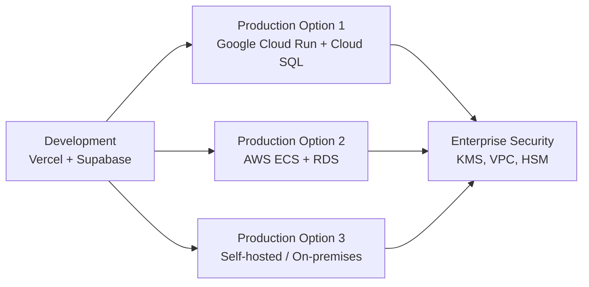

## Overview

The stack uses standard technologies with no vendor lock-in, enabling migration between deployment platforms without code changes. Start with rapid iteration on Vercel + Supabase, then migrate to Google Cloud or AWS for production security when needed.

## Philosophy

**Start fast, scale secure:**

1. **Development** - Rapid iteration on Vercel + Supabase
2. **Production** - Migrate to Google Cloud / AWS for enterprise security
3. **Zero code changes** - Only configuration changes required

## Why Portability Matters

- ✅ **No vendor lock-in** - Standard technologies, no proprietary APIs
- ✅ **Security flexibility** - Migrate to environments with KMS, VPC, HSM
- ✅ **Cost optimization** - Choose best provider for each stage
- ✅ **Compliance** - Meet enterprise security requirements when needed

## Migration Paths

## Technology Choices for Portability

### Runtime: Node.js LTS

- ✅ **Standard Node.js** - Runs anywhere (Vercel, GCP, AWS, on-premises)
- ✅ **No platform-specific code** - Pure Node.js application
- ✅ **Universal support** - All cloud providers support Node.js

### Framework: Fastify

- ✅ **Standard HTTP** - No framework lock-in
- ✅ **Portable** - Runs as standard Node.js process
- ✅ **Migration** - Change deployment target only, no code changes

### Database: PostgreSQL + Drizzle

- ✅ **Standard SQL** - Works with any PostgreSQL host
- ✅ **Plain SQL queries** - Drizzle generates standard PostgreSQL
- ✅ **No proprietary APIs** - Standard `DATABASE_URL` connection
- ✅ **Migration** - Only requires changing `DATABASE_URL`

## Deployment Options

### Development: Vercel + Supabase

**Best for:** Rapid iteration, preview environments, fast setup

- **Vercel** - Serverless functions, edge network, preview deployments
- **Supabase** - Managed Postgres, branching, local development
- **Fast setup** - Get started in minutes

### Production: Google Cloud

**Best for:** Enterprise security, compliance, Google Cloud ecosystem

- **Cloud Run** - Serverless containers, auto-scaling
- **Cloud SQL** - Managed PostgreSQL with backups
- **Security** - KMS encryption, VPC isolation, Cloud IAM
- **Migration** - Change `DATABASE_URL`, deploy to Cloud Run

### Production: AWS

**Best for:** AWS ecosystem, enterprise compliance

- **ECS / EC2** - Container orchestration or VMs
- **RDS** - Managed PostgreSQL with backups
- **Security** - KMS encryption, VPC isolation, IAM
- **Migration** - Change `DATABASE_URL`, deploy to ECS/EC2

### Enterprise: Self-Hosted / On-Premises

**Best for:** Maximum control, air-gapped environments, compliance

- **Self-hosted Postgres** - Full control over database
- **On-premises deployment** - Complete infrastructure control
- **Security** - Hardware Security Modules (HSM), air-gapped networks
- **Migration** - Deploy to on-premises infrastructure

## Migration Process

### Step 1: Prepare Database

1. Export schema and data from Supabase
2. Create new database (Cloud SQL, RDS, or self-hosted)
3. Import schema and data
4. Update `DATABASE_URL` environment variable

### Step 2: Deploy Application

1. Build Docker image (if using containers)
2. Deploy to target platform (Cloud Run, ECS, etc.)
3. Configure environment variables
4. Update DNS/routing

### Step 3: Verify

1. Test API endpoints
2. Verify database connectivity
3. Check logs and monitoring
4. Update documentation

## Security Controls

### Encryption

- **At rest** - Database encryption via KMS (Cloud KMS, AWS KMS)
- **In transit** - TLS/SSL for all connections
- **Secrets** - Environment variables, secret managers

### Network Isolation

- **VPC** - Private networking for database and services
- **VPC-SC** - Google Cloud VPC Service Controls
- **Private endpoints** - Private Service Connect, VPC endpoints

### Access Control

- **IAM** - Cloud IAM, AWS IAM for service accounts
- **Database users** - Role-based access control
- **API keys** - Secure key management

### Compliance

- **SOC 2** - Available on enterprise cloud providers
- **HIPAA** - Can be configured on GCP/AWS
- **GDPR** - Data residency controls

## Code Changes Required

**Answer: None!**

The entire stack uses standard technologies:

- ✅ **Fastify** - Standard Node.js, no platform-specific code
- ✅ **Drizzle** - Generates plain SQL, no proprietary runtime
- ✅ **PostgreSQL** - Standard SQL, works with any Postgres host
- ✅ **Environment variables** - Only `DATABASE_URL` needs to change

## Related Documentation

- [Backend Stack](/docs/architecture/backend-stack) - Technology choices
