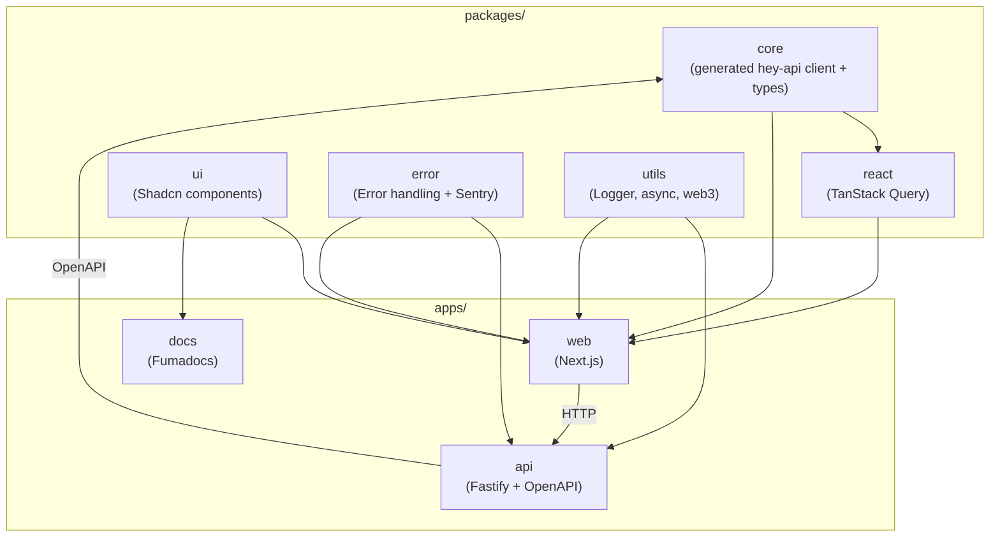

All applications and packages are organized in a single repository using **Turborepo** for orchestration. This structure enables shared code, consistent tooling, and simplified dependency management across frontend and backend applications.

## Overview

All applications and packages coexist in one repository with clear organizational boundaries:

- **`apps/`** - Applications (API, Web, Docs, etc.)
- **`packages/`** - Shared packages (core, react, ui, etc.)
- **`contracts/`** - Smart contract code (EVM, Solana) - See [EVM Contracts](/docs/blockchain/evm-contracts) and [Solana Contracts](/docs/blockchain/solana-contracts)
- **`tools/`** - Shared tooling configurations (ESLint, TypeScript)

## Why Monorepo?

We chose a monorepo over standalone repositories for several key benefits:

- ✅ **Code reuse** - Shared UI components, types, and utilities across apps
- ✅ **Unified tooling** - Consistent linting, formatting, and build standards
- ✅ **Faster CI/CD** - Turborepo caching speeds up builds and tests
- ✅ **Simplified dependencies** - Automatic synchronization across workspace packages
- ✅ **Better DX** - Single repository, consistent developer experience

## Package Dependency Graph



## Turborepo Benefits

**Turborepo** orchestrates builds and provides intelligent caching:

- **Task caching** - Only rebuilds what changed
- **Parallel execution** - Runs independent tasks simultaneously
- **Remote caching** - Share cache across team and CI/CD
- **Pipeline configuration** - Define task dependencies and execution order

## Package Organization

### Applications (`apps/`)

Each application is self-contained but can import shared packages:

- `apps/fastify` - Fastify backend API
- `apps/next` - Next.js frontend application
- `apps/docu` - Documentation site (Fumadocs)

### Shared Packages (`packages/`)

Packages follow strict dependency rules:

- **`core`** - Generated runtime-agnostic API client + types (via hey-api from OpenAPI)
- **`react`** - React-specific hooks and TanStack Query integration (generated via hey-api)
- **`ui`** - Shared UI components (Shadcn/ui based)
- **`error`** - Error handling utilities with Sentry integration (platform-specific exports)
- **`utils`** - Shared utilities (logger, async helpers, web3 utilities)

### Dependency Direction

Strict one-way dependencies prevent circular references:

```
core → react
  ↑
apps/fastify (OpenAPI)
  ↓
apps/wallet
```

## Workspace Configuration

The monorepo uses **pnpm workspaces** for dependency management:

- `workspace:*` protocol for internal package dependencies
- Symlink-based resolution for fast local development
- Proper hoisting of shared dependencies

## Development Workflow

1. **Local development** - Direct TypeScript imports (no build step)
2. **Package builds** - `tsup` compiles packages to ESM for publishing
3. **CI/CD** - Turborepo orchestrates builds with intelligent caching
4. **Publishing** - `prepack` scripts switch exports to `dist/` for npm

## Related Documentation

- [Packages Reference](/docs/core-concepts/packages) - Complete reference for all shared packages
- [Package Conventions](/docs/architecture/package-conventions) - Detailed package conventions
- [Blockchain Development](/docs/blockchain) - Smart contract development with Foundry and Anchor
- [Getting Started](/docs/getting-started) - Initial setup and quick start
