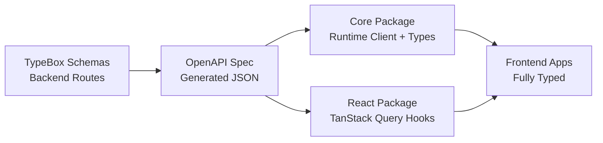

## Overview

The OpenAPI generation workflow provides end-to-end type safety from backend routes to frontend clients. We use **TypeBox** for route schemas, generate **OpenAPI** specs, and then generate **TypeScript clients with Zod schemas** using Hey API.

## Data Flow

**TypeBox (Backend) → OpenAPI Spec → Zod Schemas + Types (Frontend)**



## Step 1: Define TypeBox Schemas

TypeBox schemas are native JSON Schema definitions for Fastify routes:

```typescript
// apps/fastify/src/routes/users.ts
import { Type } from '@sinclair/typebox'

const UserSchema = Type.Object({
  id: Type.String(),
  email: Type.String({ format: 'email' }),
  name: Type.String(),
})

const ErrorSchema = Type.Object({
  code: Type.String(),
  message: Type.String(),
})

fastify.get('/users/:id', {
  schema: {
    params: Type.Object({ id: Type.String() }),
    response: {
      200: UserSchema,
      404: ErrorSchema,
    },
  },
}, async (request, reply) => {
  // Implementation
})
```

## Step 2: Generate OpenAPI Spec

The OpenAPI specification is automatically generated from Fastify routes:

```bash
pnpm --filter @repo/fastify gen:openapi
```

This runs `generate-openapi.ts` which:
1. Scans Fastify route definitions
2. Extracts TypeBox schemas
3. Generates OpenAPI 3.0 spec at `apps/fastify/openapi/openapi.json`

**Key benefits:**
- No manual OpenAPI writing
- Single source of truth (TypeBox schemas)
- Automatic synchronization

## Step 3: Generate TypeScript Clients

Hey API generates type-safe clients from the OpenAPI spec:

```bash
# Generate runtime-agnostic client
pnpm --filter @repo/core gen

# Generate React Query hooks
pnpm --filter @repo/react gen
```

This generates:
- **`packages/core/src/gen/`** - Runtime-agnostic client with types
- **`packages/react/src/gen/`** - React Query hooks with TanStack Query integration

**Generated code includes:**
- Fully typed API methods
- Zod schemas for runtime validation
- Request/response types
- TanStack Query hooks (React package)

## Step 4: Use Generated Clients

The generated clients provide full type safety:

```typescript
import { createApi } from '@repo/core'
import { useUser } from '@repo/react'

// Runtime-agnostic client
const api = createApi({
  baseUrl: process.env.NEXT_PUBLIC_API_URL!,
  getAuthToken: async () => session?.token,
})

// Fully typed API call
const user = await api.getUser({ id: '123' })
// user is typed from OpenAPI spec

// Or use generated React Query hooks
const { data, isLoading, error } = useUser({ id: '123' })
// data is typed as User | undefined
```

## Benefits

- ✅ **End-to-end type safety** - Types flow from routes → OpenAPI → clients automatically
- ✅ **No duplication** - Define schemas once, generate everything
- ✅ **Automatic synchronization** - OpenAPI and clients stay in sync with routes
- ✅ **Runtime validation** - Zod schemas provide runtime type checking
- ✅ **Framework portability** - Works with any framework that consumes OpenAPI
- ✅ **Multi-language support** - Generate clients for TypeScript, Python, Go, Rust, etc.

## Complete Workflow

When adding a new endpoint:

1. **Implement route** - Define TypeBox schemas and implement Fastify route
2. **Generate OpenAPI** - Run `pnpm --filter @repo/fastify gen:openapi`
3. **Generate clients** - Run `pnpm --filter @repo/core gen` and `pnpm --filter @repo/react gen`
4. **Use typed client** - Import and use in frontend with full type safety

## OpenAPI Spec Location

The generated OpenAPI spec is available at:
- **File**: `apps/fastify/openapi/openapi.json`
- **Endpoint**: `/reference/openapi.json` (programmatic access)
- **Interactive docs**: `/reference` (Scalar UI)

## Client Generation Configuration

Client generation is configured in:
- **Core package**: `packages/core/openapi-ts.config.ts` (Hey API config)
- **React package**: `packages/react/openapi-ts.config.ts` (Hey API config with TanStack Query plugin)

## Related Documentation

- [API Architecture](/docs/core-concepts/api-architecture) - REST API with Fastify and OpenAPI
- [Packages Reference](/docs/core-concepts/packages) - Complete package reference
- [Backend Stack](/docs/architecture/backend-stack) - Fastify and backend architecture
