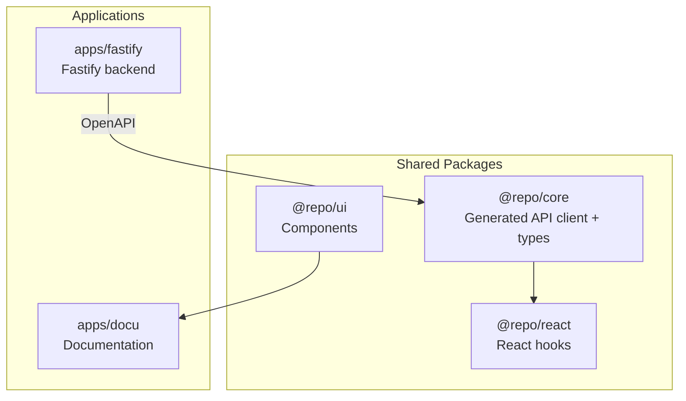

## Prerequisites

- Node.js >= 22
- pnpm 10.28.0
- (Optional) PostgreSQL or Supabase account

## Setup

### Install pnpm

If you don't have pnpm installed, install it using one of the following methods:

**Using npm:**
```bash
npm install -g pnpm@10.28.0
```

**Using corepack (recommended):**
```bash
corepack enable
corepack prepare pnpm@10.28.0 --activate
```

**Using standalone script:**
```bash
curl -fsSL https://get.pnpm.io/install.sh | sh -
```

Verify your installation:
```bash
pnpm --version
```

## Quick Start

### 1. Clone and Install (2 min)

```bash
git clone <repository-url>
cd <project-name>
pnpm install
```

### 2. Explore the Running Apps (3 min)

```bash
pnpm dev
```

- **API**: http://localhost:3001 (`GET /health`, `/reference` for docs)
- **Docs**: http://localhost:3002

### 3. Understand the Structure (5 min)

**Apps:** `apps/fastify/` (Fastify backend), `apps/next/` (Next.js frontend), `apps/docu/` (documentation)

**Packages:** `core/` (generated API client + types), `react/` (React Query hooks), `ui/` (components), `error/` (error handling), `utils/` (utilities)



### 4. Make Your First Change (5 min)

1. Open `apps/next/app/page.tsx` in your editor
2. Make a small change (e.g., update the heading text)
3. Save the file - the dev server will hot-reload automatically
4. Open http://localhost:3000 in your browser to see your changes
5. Verify the change appears correctly

## Next Steps

**Continue your AI-assisted development setup:**
- [Installation](/docs/getting-started/installation) - Environment variables and optional database setup
- [AI Workflow](/docs/getting-started/ai-workflow) - Recommended development workflow
- [Cursor Setup](/docs/getting-started/cursor-setup) - Configure your IDE

**Understand Core Concepts:**
- [Core Concepts](/docs/core-concepts) - Fundamental concepts like monorepo structure, API architecture, and OpenAPI generation
- [Architecture](/docs/architecture) - Deep technical details and design decisions

**Optional Setup:**

For database features, you'll need PostgreSQL. See [Installation](/docs/getting-started/installation).

For EVM contract development, install Foundry. See [EVM Contracts](/docs/blockchain/evm-contracts).
For Solana contract development, install Anchor. See [Solana Contracts](/docs/blockchain/solana-contracts).
