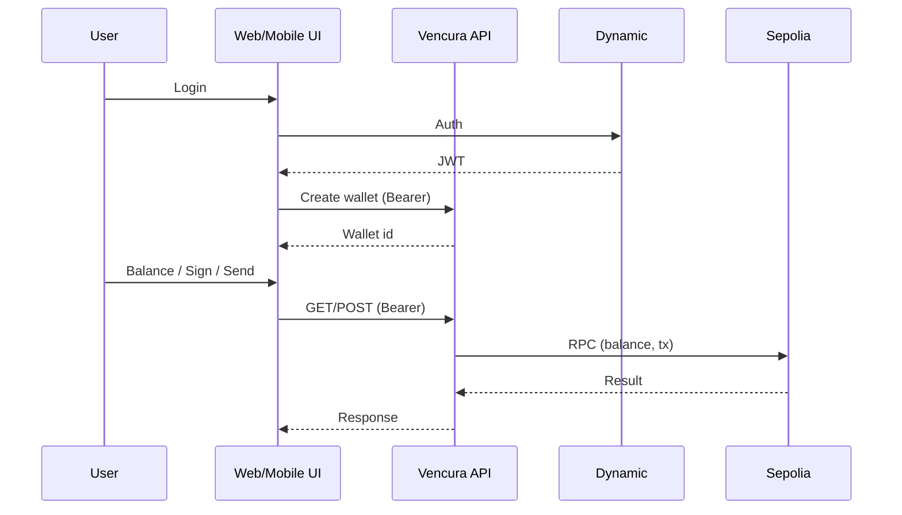

Vencura Wallet is the Venmo of wallets — a custodial wallet platform for users new to Web3. The name combines "Venmo" and "Custodian" ("Cura" means care or guardianship in Latin). Authenticated users create wallets on the backend; all wallet operations run via API.

## Goals

- **Backend-only operations** — getBalance, signMessage, sendTransaction executed on the server
- **Dynamic authentication** — Magic link, OAuth, Web3 sign-in, and API keys
- **Basic UI** — Web dashboard and Expo mobile app to showcase the API
- **Security first** — Encrypted keys at rest, rate limiting, address validation

## Value Proposition

Users who do not yet have wallets can start their Web3 journey with custodial wallets. The platform manages private keys; users interact via a simple UI or API. No keys touch the client.

## Architecture at a Glance

## Next Steps

- [**Product Overview**](/docs/product/overview) — Required vs optional features, Dynamic take-home alignment
- [**Custodial Wallets API**](/docs/product/wallets) — Endpoints, auth, examples
- [**Security Model**](/docs/product/security) — Encrypted keys, rate limiting
- [**Architecture**](/docs/architecture) — Monorepo, API, authentication
