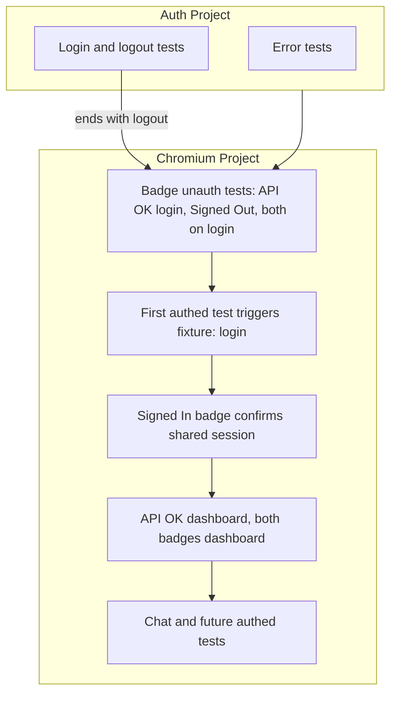

Frontend apps (for example `apps/web`) use **Playwright E2E tests only**. We do not maintain separate unit or integration test suites for frontend components.

## Testing Philosophy

**CRITICAL**: Frontend quality is validated through real user flows against real APIs and infrastructure.

- E2E tests cover core user journeys end-to-end
- Tests run against real endpoints and infrastructure (Next.js + Fastify)
- Tests use test-scoped credentials supplied via `TEST_*` environment variables, not production keys. Ensure CI and local setups supply only test secrets; never commit production secrets
- No Vitest/Testing Library suites for frontend apps

We intentionally invest in a smaller number of high-signal E2E tests instead of broad unit coverage on the frontend.

## Test Structure (Frontend)

### E2E Tests

- **Location**: `e2e/**/*.spec.ts`
- **Pattern**: Test full user flows with real infrastructure
- **Real APIs**: All tests use real APIs and infrastructure
- **Tools**: Playwright
- **Commands**: Next: `pnpm --filter @repo/web test:e2e:local` (spawn servers) or `pnpm test:e2e` (URLs from env/params). Root: `pnpm test:e2e` runs Fastify + Next E2E.

See [E2E Testing](/docs/testing/e2e-testing) for full documentation.

**Example Structure:**
```typescript
import { test, expect } from '@playwright/test'

test.describe('Magic Link Auth E2E', () => {
  test('should complete full authentication flow', async ({ page }) => {
    // Navigate to login page (use /auth/login route)
    await page.goto('/auth/login')
    
    // Submit form (makes real API call to Fastify server)
    await page.fill('input[type="email"]', 'test@test.ai')
    await page.click('button[type="submit"]')
    
    // Extract token from real Fastify test endpoint
    const response = await fetch('http://localhost:3001/test/magic-link/last')
    const { token } = await response.json()
    
    // Verify magic link (callback page sets cookies)
    await page.goto(`/auth/callback/magiclink?token=${token}&callbackURL=/`)
    
    // Verify authenticated state (JWT cookie readable on client for SSR convenience)
    await expect(page.locator('text=Dashboard')).toBeVisible()
  })
})
```

**E2E Authentication and Fixtures**

- **workers: 1** — Required for PGlite (Fastify test DB) to avoid concurrent writer issues
- **Test order** — Auth project first (magic-link-auth: error tests, login/logout; ends with logout). Chromium: unauth badge tests first, then first authed test triggers fixture and confirms session, then remaining authed tests run consecutively
- **Chat E2E** — Requires `ANTHROPIC_API_KEY` (Anthropic Sonnet); see [E2E Testing](/docs/testing/e2e-testing) for env vars. If UNAUTHORIZED, session/Bearer propagation to Fastify `/ai/chat` needs debugging.
- **Session model** — One login per worker via `authenticatedStorageState` fixture; cookies/storage saved to `test-results/.auth/user.json` (gitignored); each authed test gets a new context created with that storageState. No per-test login
- **Login/logout tests** — Import from `@playwright/test`, use `page`; need fresh contexts to verify the flow
- **Authed feature tests** — Import from `e2e/fixtures`, use `authenticatedPage`; no `loginAsTestUser` in test body. Each test gets a fresh context with saved storageState; navigate to target route (e.g. `goto('/')`) before asserting

Example for authed tests:

```typescript
import { expect, test } from './fixtures'

test('should show dashboard when authenticated', async ({ authenticatedPage }) => {
  await authenticatedPage.goto('/')  // fresh context with storageState; navigate before assert
  await expect(authenticatedPage.locator('text=Signed In')).toBeVisible()
})
```

Execution flow: Auth (error, login, logout) → Badge unauth (API OK login, Signed Out, both on login) → First authed test (triggers login, confirms Signed In) → Remaining authed tests (badges, chat, etc.)



## Test Coverage Requirements (Frontend)

### Required Coverage

- **Core Flows**: Authentication, navigation, and primary dashboard flows
- **User Interactions**: Clicks, form submissions, and navigation for key journeys
- **API Integration**: Happy path and critical error paths with real APIs
- **Error Handling**: User-visible error states and messages for core flows
- **Loading States**: Loading and empty states on key pages

## Environment Setup

### Required Environment Variables

Tests require these environment variables:

- `NEXT_PUBLIC_API_URL` - API base URL
- `TEST_AUTH_TOKEN` (optional) - Pre-configured auth token

### Test Utilities

Create/maintain Playwright helpers in `apps/web/e2e` for common flows (auth, navigation, fixtures). Prefer shared fixtures over ad-hoc login logic inside individual specs.

## Running Tests

See [apps/web/README.md](../../../../apps/web/README.md) and [E2E Testing](/docs/testing/e2e-testing) for E2E scripts (`test:e2e`, `test:e2e:local`, `test:e2e:ui`, `test:e2e:debug`).

## Related Documentation

- [Testing Overview](/docs/testing) - High-level testing strategy across apps
- [Frontend Architecture](/docs/architecture/frontend) - Next.js and React architecture
